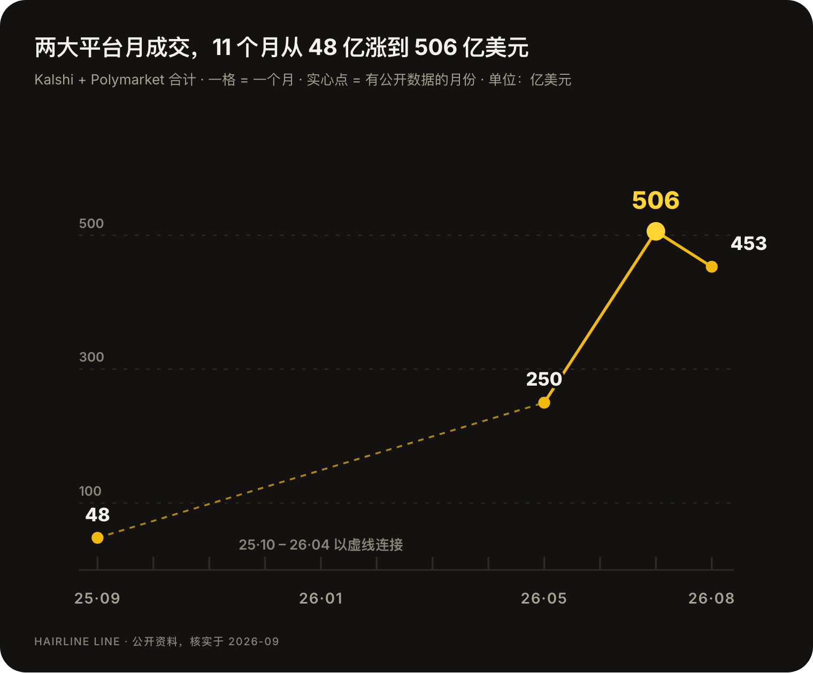
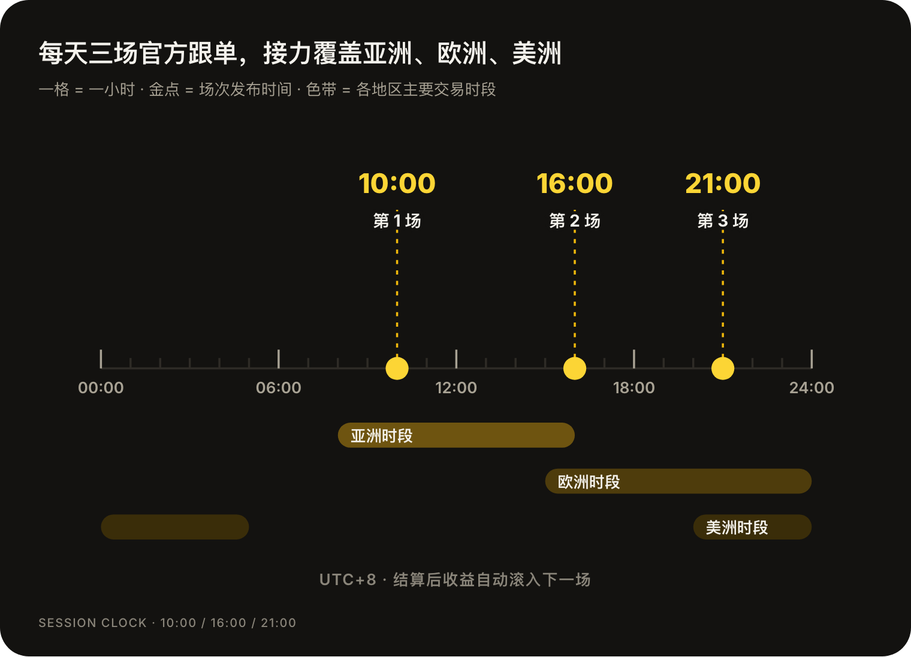
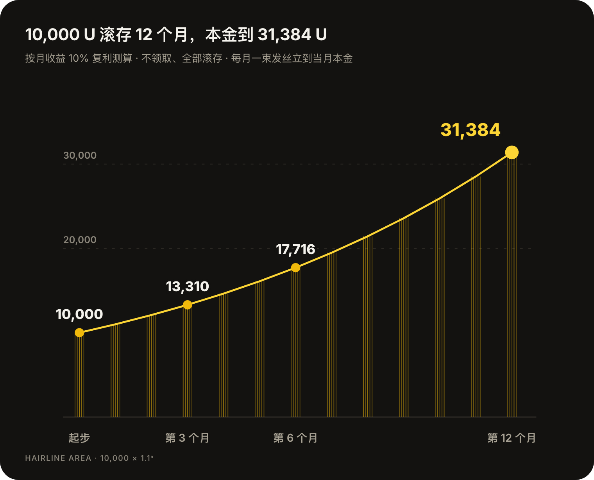
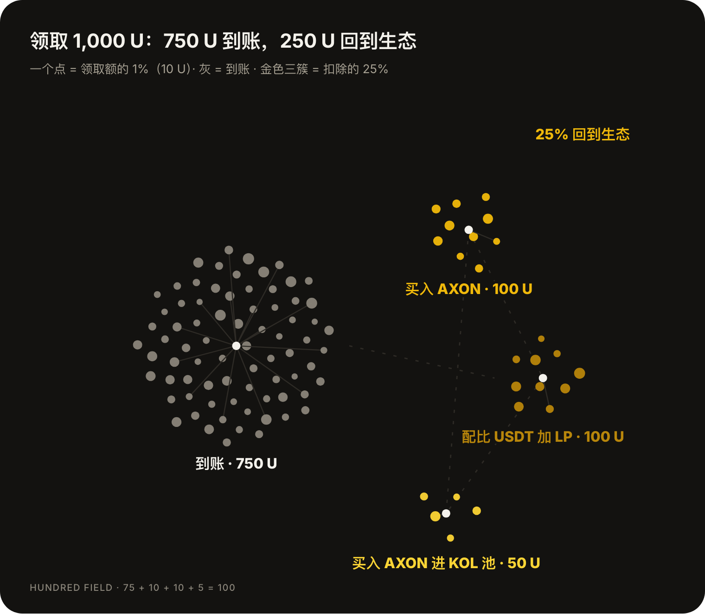
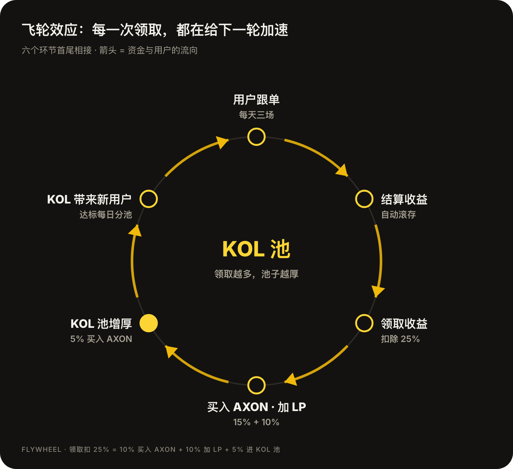
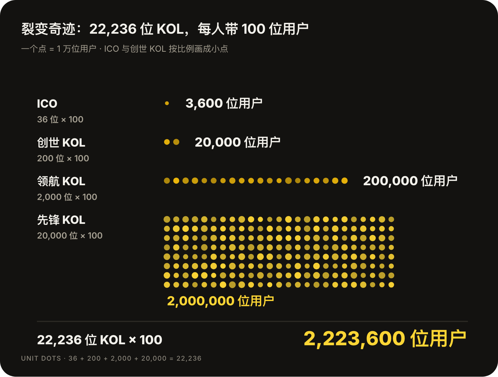
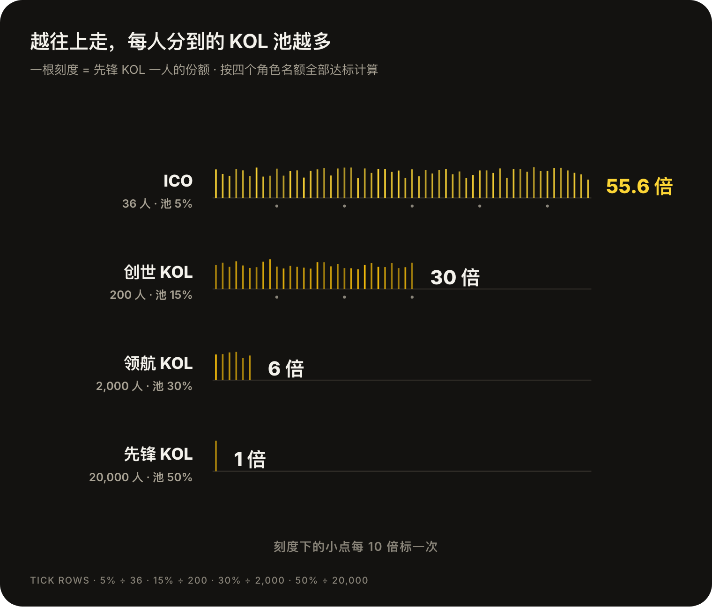
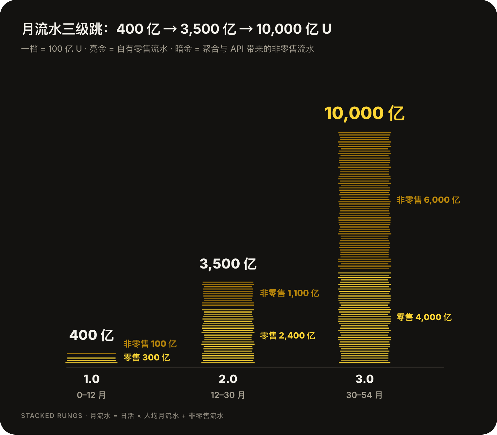

# 一文读懂 Kairos


Kairos 每天发布三场官方跟单，月收益 10%，每场结算后收益自动滚入下一场。领取收益时扣除 25%，其中 15% 买入 AXON，10% 配比 USDT 加进流动性池。平台正在招募 22,236 位 KOL，达标的 KOL 每天 9 点分享 KOL 池。全文计价单位为 U，锚定 USDT。


## 一、预测市场这一年

2025 年 9 月，Kalshi 和 Polymarket 两家加起来，一个月成交还不到 50 亿美元。到了 2026 年 7 月，这个数字是 506 亿美元。

资本和监管几乎在同一年到位。Kalshi 在 F 轮拿到 220 亿美元估值，年化收入越过 20 亿美元；纽交所母公司 ICE 向 Polymarket 投入 20 亿美元。2026 年 3 月，CFTC 把预测市场正式归入衍生品，同年 7 月联邦法院确认了 CFTC 的排他管辖权，这个品类第一次有了清楚的监管归属。

分发渠道随后跟上。币安接入 Predict.fun，Coinbase 接入 Kalshi，IBKR 把三家平台放进同一个交易界面，Robinhood 直接收购了一家清算设施。用户在券商、钱包和新闻 App 里就能下单，至于订单最后由哪个市场撮合，他们很少在意。

事件可以被交易，这件事已经被证明了。接下来难的是交易之外的部分：大多数人看不懂赔率，平台要怎样把他们带进来，把人带进来的那些人又能分到什么？

**Kairos 做的就是这一步：用 AI 把预测变成普通人也跟得上的官方跟单，再把每一笔收益领取中的一部分，持续分给带来用户的 KOL。**

## 二、Kairos 是什么

Kairos Markets 是 AI 原生的 Web4.0 流量聚合器和预测平台。名字取自希腊语 καιρός，指稍纵即逝的关键时刻；希腊神话里的时机之神 Kairos 额前留着一绺头发，机会来时要当面抓住。

平台靠两台引擎运转：

<table data-view="cards"><thead><tr><th></th><th></th></tr></thead><tbody><tr><td><h4>AI 预测平台</h4></td><td>把金融、政治、气候、科技、体育、文化、娱乐、AI、粉丝经济与社会趋势十大赛道里的事件，做成可交易、链上结算的概率。官方跟单在这里运行。</td></tr><tr><td><h4>Web4.0 超级流量聚合器</h4></td><td>预测带来的流量在这里换成回报：跟单收益、KOL 池分配、合作项目的早鸟额度与空投，以及机构级投研。</td></tr></tbody></table>

预测把用户带进来，聚合器让他们留下来并拿到回报，两台引擎共用同一批用户。

AXON 是 Kairos 生态的激励代币。KOL 池奖励与三档 KOL 权益认购附带的奖励，都以 AXON 发放。

平台里的五个 AI 智能体

| 智能体 | 职责 |
| :-- | :-- |
| 市场创建智能体 | 扫描全网热点，把趋势做成可结算、可裁决的预测话题 |
| 信号 · 跟单智能体 | 融合行情、赔率与跨市场价差，筛选官方跟单场次 |
| 风控智能体 | 实时监控敞口、对冲覆盖率与准备金水位，触及红线自动降级 |
| 预见助理 | 用对话讲清事件在预测什么、当前概率多大、最多亏多少 |
| 结算辅助智能体 | 聚合多源数据，辅助预言机与 DAO 裁决 |

手续费

| 费用 | 费率 | 收取对象 |
| :-- | --: | :-- |
| 交易手续费 | 0.5% | 每位成交方，单边收取 |
| 结算手续费 | 2% | 仅对获胜结果 |

所有费用在链上执行，可公开审计。

## 三、时间复利：每天三场官方跟单

官方团队、AI 信号引擎与量化做市台每天选出三场高确定性事件，北京时间 10:00、16:00、21:00 依次发布，正好接上亚洲、欧洲和美洲的主要交易时段。用户选好金额一键跟单，模型测算、跨市场对冲和结算都在后台完成。

一个事件要进入跟单名单，需要同时满足五个条件：结果有权威数据源，判定口径事前锁定；Kairos 与外部主流平台上都有足够深度；模型概率高出市场价格一段足够的安全垫；能在外部市场以可接受的成本反向锁价；从跟单到结算的周期可控。美联储议息、选举分项席位、世界杯淘汰赛、CPI 数据发布，都是常见的场次。

**官方跟单月收益 10%，以 USDT 结算。** 以四个 KOL 角色的个人跟单门槛为例：

| 跟单金额 | 月收益 | 对应角色门槛 |
| :-- | --: | :-- |
| 500 U | **50 U** | 先锋 KOL |
| 2,000 U | **200 U** | 领航 KOL |
| 5,000 U | **500 U** | 创世 KOL |
| 10,000 U | **1,000 U** | ICO |

每场结算之后，收益自动滚进下一场接着跟单。10,000 U 一直不领，按月收益 10% 复利测算，第 6 个月本金到 17,716 U，第 12 个月到 31,384 U，是起步时的 3.14 倍。



跟单收益有四层现金流，每一层都有独立来源：

* **模型与市价的背离**：只选模型概率明显高于市价的场次。市价 0.62、模型评估 0.80，中间 0.18 就是安全垫。
* **跨市场对冲**：量化台在外部平台反向锁价，最坏情况下的损失在开场前就有了上限。
* **平台营收划拨**：手续费按固定比例注入准备金池，地址公开，链上可以审计。
* **获客预算转化**：原本要投给广告平台的预算，转成用户的真实收益。



风控智能体实时盯着三条红线：

| 监控项 | 红线 |
| :-- | --: |
| 单场对冲覆盖率 | ≥ 60% |
| 准备金覆盖率 | ≥ 150% |
| 单场跟单总额 | ≤ 预设上限 |

单场跟单总额触顶时，这一场的跟单窗口提前关闭。



遇到极端行情，跟单按三级处理：

1. **正常**：按计划发布场次。
2. **减场减额**：预算或覆盖率吃紧时，减少场次与单场额度。
3. **暂停**：极端行情或系统性风险下，暂停发布新场次，已经开出的场次照常结算。



## 四、单边上涨：每一笔领取都是一张买单

收益可以一直滚存，也可以领取出来。领取时扣除 25%，这 25% 全部回到生态：10% 直接买入 AXON，10% 配比 USDT 添加流动性池（LP），另外 5% 买入 AXON 后进入 KOL 池。滚存中的收益不产生扣除。

按这个比例，用户每领取 1,000 U，就有 150 U 在市场上买入 AXON，还有 100 U 的 USDT 被加进 LP。平台领取量放大之后，这股买盘会跟着放大：

| 平台单日领取额 | 买入 AXON（15%） | 其中进入 KOL 池（5%） | 配比 USDT 加 LP（10%） | 用户到账（75%） |
| :-- | --: | --: | --: | --: |
| 100 万 U | **15 万 U** | 5 万 U | 10 万 U | 75 万 U |
| 500 万 U | **75 万 U** | 25 万 U | 50 万 U | 375 万 U |
| 1,000 万 U | **150 万 U** | 50 万 U | 100 万 U | 750 万 U |

单日领取 100 万 U 连续一个月，AXON 的买单累计就有 450 万 U，同期加进 LP 的 USDT 有 300 万 U。AXON 的买盘直接跟着跟单规模走。

## 五、飞轮效应

跟单用户每领取一次，KOL 池就多一份 AXON。KOL 拿到的奖励来自这个池子，于是他们有动力去带更多人跟单；新用户跟单、结算、领取之后，又把池子继续做厚。用户的收益、KOL 的奖励和 AXON 的流动性，最终转在同一个轮子上。

## 六、裂变奇迹：22,236 位 KOL，200 万用户

Polymarket 大约有 48 万活跃用户，Kalshi 大约 84 万，两家加起来约 130 万。Kairos 把 200 万用户的目标拆成 22,236 份：招募 22,236 位 KOL，每位 KOL 带来 100 位真实用户，合计 2,223,600 位，比目标多出一成余量。

KOL 分四个角色，名额越少，分到的 KOL 池份额越集中：

| 角色 | 名额 | 个人跟单 | 网体每日新增跟单 | KOL 池分配 |
| :-- | --: | --: | --: | --: |
| ICO | 36 人 | 10,000 U | 10,000 U | **5%** |
| 创世 KOL | 200 人 | 5,000 U | 5,000 U | **15%** |
| 领航 KOL | 2,000 人 | 2,000 U | 2,000 U | **30%** |
| 先锋 KOL | 20,000 人 | 500 U | 500 U | **50%** |
| 合计 | 22,236 人 |  |  | 100% |

两条门槛要同时达到。个人跟单看本人名下的跟单金额；网体每日新增跟单看团队当天新增的跟单，统计时去掉大区业绩，只算小区新增。比如三条线当天分别新增 8,000 U、1,500 U、800 U，去掉 8,000 U 的大区，小区新增合计 2,300 U，已经够到领航 KOL 的网体门槛。

先锋 KOL 名额最多，整个角色拿走 KOL 池的一半；往上走，每个人分到的份额成倍放大。四个角色名额全部达标时，一位 ICO 分到的份额相当于 55.6 位先锋 KOL：


**从先锋 KOL 起步：** 认购先锋 KOL 权益 500 U，个人跟单 500 U，网体每日新增跟单 500 U，达标后参与每日 9 点的 KOL 池分配。


## 七、收益推演：KOL 的两份收入

KOL 的收入分两条线：KOL 池每天分 AXON，权益佣金每月结 USDT。两条线分别结算。

### KOL 池：一笔奖励怎么算出来

以某天跟单收益领取 50 万 U、当天只有一位 ICO 达标为例：



### 领取计提 5%

当天领取 500,000 U，其中 5% 也就是 25,000 U 用于买入 AXON。



### 按实时价买入进池

25,000 U 按实时价买入 250,000 枚 AXON，进入 KOL 池。



### 按角色份额分配

ICO 的分配比例是 5%，这位 ICO 当天获得 12,500 枚 AXON。



### 180 天平均释放

12,500 枚分 180 天平均释放，每天到账 69.44 枚，KOL 池按日扣除。



分配每天 9 点进行，同一角色里达标的 KOL 平均分。当天没领取的额度会在 KOL 池里一直累计，领取后尚未释放的部分也继续留在池中。分配比例为动态配置。

### 权益认购与佣金

KOL 权益分三档认购，认购金额与个人跟单门槛一一对应，ICO 位于创世 KOL 之上：

| 档位 | 认购 | 佣金比例 | 核心权益 | 代币奖励 |
| :-- | --: | --: | :-- | :-- |
| 先锋 KOL | 500 U | 0.01% | 先锋 KOL 权益 · 团队交易分润 | AXON · 180 天释放 |
| 领航 KOL | 2,000 U | 0.05% | 领航 KOL NFT · 交易额分润基础权益 | AXON · 180 天释放 |
| 创世 KOL | 5,000 U | 0.1% | 创世 KOL NFT · 交易额分润专属权益 | AXON · 180 天释放 |

佣金按团队月交易额乘以佣金比例计算，每月以 USDT 结算，链上可查：

| 团队月交易额 | 先锋 0.01% | 领航 0.05% | 创世 0.1% |
| :-- | --: | --: | --: |
| 100 万 U | 100 U | 500 U | **1,000 U** |
| 500 万 U | 500 U | 2,500 U | **5,000 U** |
| 1,000 万 U | 1,000 U | 5,000 U | **10,000 U** |
| 5,000 万 U | 5,000 U | 25,000 U | **50,000 U** |

两条收益线放在一起看：

|  | KOL 池 | 权益佣金 |
| :-- | :-- | :-- |
| 拿到的条件 | 达到角色的两条门槛 | 完成权益认购 |
| 怎么计算 | 领取额 5% 买入的 AXON × 角色份额，同角色平均分 | 团队月交易额 × 佣金比例 |
| 以什么发放 | AXON | USDT |
| 什么时候到账 | 每日 9 点分配，领取后 180 天平均释放 | 按月结算 |

## 八、三个阶段，54 个月

月流水由三个数决定：日活、人均月流水，以及聚合与 API 带来的非零售流水。三个阶段按这个算式排：

| 阶段 | 时间 | 日活 | 人均月流水 | 月流水 | 核心动作 |
| :-- | :-- | --: | --: | --: | :-- |
| **1.0 目的地** | 0–12 月 | 50 万 | 6 万 U | **400 亿 U** | 收齐 22,236 个 KOL 席位，跑通跟单与 KOL 池闭环 |
| **2.0 聚合层** | 12–30 月 | 200 万 | 12 万 U | **3,500 亿 U** | 接入外部交易场所，做事件资产标准化与最优执行 |
| **3.0 基础设施与资本化** | 30–54 月 | 200 万 | 20 万 U | **10,000 亿 U** | 输出 API 与白标，补齐衍生品线，完成美国上市 |

到了 3.0，月流水里有六成来自非零售。头部玩家正把预测市场推到幕后、自己守住入口，行业因此分成三层：前端入口、聚合与路由、市场与结算。Kairos 自建前两层，第三层自建一部分、其余外接。同一个事件在不同平台上的截止时间、判定条件或结算规则稍有差别，就是两个不同的资产，先把事件资产标准化做出来的平台，才拿得到聚合层的位置。

## 九、核心参数速查

| 参数 | 取值 |
| :-- | :-- |
| 官方跟单 | 每天 3 场，北京时间 10:00 / 16:00 / 21:00 |
| 跟单收益 | 月收益 10%，USDT 结算，结算后自动滚入下一场 |
| 领取扣除 | 25%：10% 买入 AXON · 10% 配比 USDT 加 LP · 5% 买入 AXON 进 KOL 池 |
| KOL 角色 | ICO 36 人 · 创世 200 人 · 领航 2,000 人 · 先锋 20,000 人，合计 22,236 人 |
| 达标门槛 | 个人跟单 + 网体每日新增跟单：10,000 / 5,000 / 2,000 / 500 U；网体只统计小区新增 |
| KOL 池分配 | 5% / 15% / 30% / 50%，每日 9 点，同角色平均分，领取后 180 天平均释放 |
| 权益认购 | 先锋 500 U · 领航 2,000 U · 创世 5,000 U |
| 佣金比例 | 0.01% / 0.05% / 0.1%，按团队月交易额计，每月 USDT 结算 |
| 平台手续费 | 交易 0.5%（单边）· 结算 2%（仅获胜结果） |
| 三阶段月流水 | 400 亿 → 3,500 亿 → 10,000 亿 U |

预测市场的上半场证明了事件可以被交易，Kairos 想让更多人在关键时刻跟得上，也分得到。

**现在开始：** 在官网注册，从先锋 KOL 起步。

<table data-view="cards"><thead><tr><th></th><th></th><th data-hidden data-card-target data-type="content-ref"></th></tr></thead><tbody><tr><td><h4>官网</h4></td><td>kairosmarkets.online</td><td><a href="https://kairosmarkets.online">https://kairosmarkets.online</a></td></tr><tr><td><h4>X</h4></td><td>@KairosMkts</td><td><a href="https://x.com/KairosMkts">https://x.com/KairosMkts</a></td></tr><tr><td><h4>公告频道</h4></td><td>t.me/KairosMktsAnn</td><td><a href="https://t.me/KairosMktsAnn">https://t.me/KairosMktsAnn</a></td></tr><tr><td><h4>交流群</h4></td><td>t.me/KairosMkts</td><td><a href="https://t.me/KairosMkts">https://t.me/KairosMkts</a></td></tr></tbody></table>
